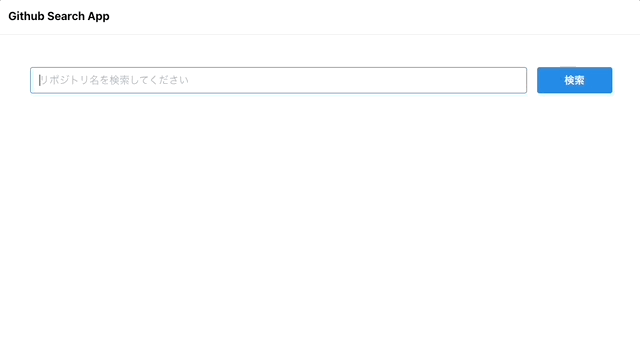
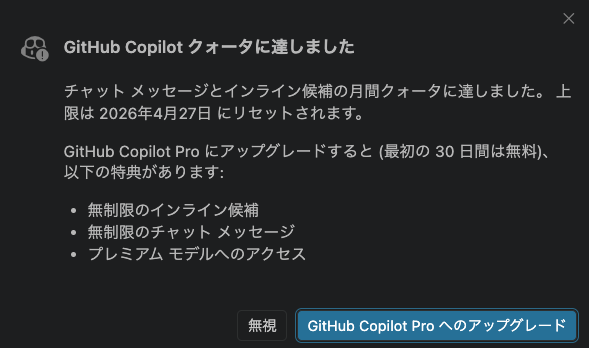
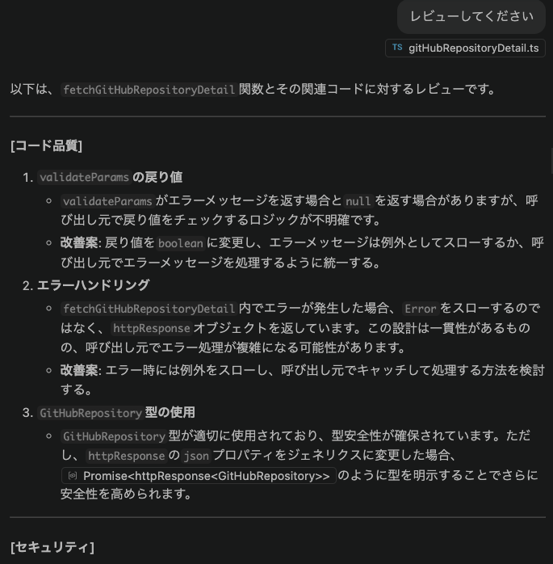
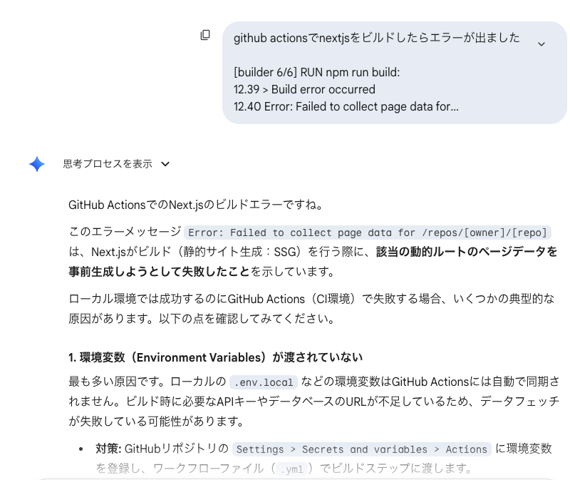

# GitHub Search App

## 概要

Githubのリポジトリ情報を検索するWebアプリケーションです。



## 使い方

[こちら](https://github-search-app-gamma.vercel.app/)のWebページからアクセスできます（Basic認証あり）。

コンテナイメージをローカルマシンにpullして、セルフホストでも使用できます。

Dockerがインストールされている環境で以下のコマンドを入力してください。
```bash
docker run -it -p 3000:3000 ghcr.io/yamako-maxq/github-search-app:latest
```

このようなエラーが出る場合があります。
```
Error response from daemon: Head "https://ghcr.io/v2/yamako-maxq/github-search-app/manifests/latest": denied: denied
```

この場合は、お手数ですが以下のコマンドを入力してください（Dockerでghcrにログインしている場合、ログアウトされますのであらかじめご了承ください。）
[参考文献](https://qiita.com/aKuad/items/8885da126d829470f42b)
```bash
docker logout ghcr.io
```

こちらから確認してください。
http://localhost:3000/

## 機能
- GitHubのリポジトリ検索
  - リポジトリ一覧表示
  - ユーザアイコン
  - 詳細画面へのリンク
- リポジトリの詳細情報
  - ユーザ名
  - ユーザアイコン
  - 使用言語
  - Star数
  - Watcher数
  - Fork数
  - Issues数
- リンクからのページ表示
  - 例１：[searchと検索した結果の3ページ目](https://github-search-app-gamma.vercel.app/search/repositories?q=search&page=3)
  - 例２：[このリポジトリの詳細画面](https://github-search-app-gamma.vercel.app/repos/yamako-maxq/github-search-app)

## こだわった点
### デプロイ
成果物の確認のため、Vercelを用意しました。  
万が一Vercelが動作しないことを考慮し、コンテナイメージを作成し、Github Container Registryにプッシュしました。
コンテナイメージは[こちら](https://github.com/yamako-maxq/github-search-app/pkgs/container/github-search-app)

Vercel、コンテナイメージ共に、デプロイはGithub Actionsを使用し、mainブランチにコードがpushされた際にデプロイされるようにしています。

### コンテナイメージ
成果物のコンテナイメージとして、Distrolessを使用しました。
Googleが提供しており、アプリケーションの実行に必要な最低限のコンポーネントのみを持たせたイメージです。
これにより、イメージサイズの縮小、セキュリティの向上を行いました。

### ルーティング
GitHub REST APIと同じルーティングで動作させ、追加の機能があった際にも対応できる拡張性をもたせました。
例えば
- `/search/code`で、コードの検索を行う
- `/search/users`で、ユーザの検索を行う

### URLパラメーターによる検索
URLパラメーターに検索結果やページ数を追加し、URLを共有したら同じ結果を見られるようにしました。
例：[searchと検索した結果の3ページ目](https://github-search-app-gamma.vercel.app/search/repositories?q=search&page=3)

### Next.js
ユーザーが操作をする検索ページ(`/search/repositories`)はCSR、情報だけを表示するリポジトリの詳細ページ(`/repos/owner/repo`)はSSRでレンダリングするようにしました。

`/repos/owner/repo`をサーバーサイドでレンダリングするにあたって、APIをサーバー側でfetchする関係上、レートリミットの問題がありました（1時間に60回まで）。こちらは、キャッシュの利用と認証トークンを設定し、最低で1時間に5000回のアクセスに対応しました。

コンポーネントの作成にはContainer/Presentationalパターンを採用し、ロジックとUIを分離させて実装を行いました。

### テスト
Jestによる各種コンポーネントやカスタムフックスのテスト、PlaywrightによるE2Eのテストを行いました。
Playwrightのテスト結果はGithub Pagesで確認できるように設定を行うようにしました。（[テストレポート](https://yamako-maxq.github.io/github-search-app/)）

### CI/CD
GitHub ActionsでCI/CDパイプラインを構築しました。
Jestによるテスト、PlaywrightによるE2Eテストをmain、developブランチで行いました。
mainブランチにコードがマージされると、Vercelとコンテナイメージのビルドとプッシュが走るようになっています。

### セキュリティ
ソフトウェアサプライチェーン攻撃の対策として、.npmrcにmin-release-ageを設定し、リリースしてから最低でも7日経過しているものをインストールしました。

## 技術スタック
- フレームワーク
  - Next.js `16.2.1`
- ホスティング
  - Vercel
- コンテナイメージ
  - gcr.io/distroless/nodejs22
- デザインライブラリ
  - Mantine `8.3.18`
- URLパラメーター管理
  - nuqs `2.8.9`
- テスト
  - Jest `30.3.0`
  - testing-library/dom `10.4.1`
  - testing-library/jest-dom `6.9.1`
  - testing-library/react `16.3.2`
  - testing-library/user-event `14.6.1`
  - Playwright `1.58.2`
  - json-server `0.17.4`

## 技術スタックの選定に関して
### Mantine
Metabaseで利用されているデザインコンポーネントです。
TailwindやMUIも候補にありましたが、以前から使ってみたいと思い選定しました。
キーボードショートカットなどのカスタムフックスも豊富で、個人的に今後も利用したいと思っています。

### nuqs
URLのパラメータ管理ライブラリです。
型安全で簡単にURLパラメーターを管理できます。
サーバーコンポーネントでも使用でき、軽量なので、以前から使ってみたく選定しました。
今回は、検索結果をURL共有できるようにしたいと思い使用しました。
当初は、URLSearchParamsを使ったURLパラメーターの処理を自前で書くつもりでしたが、
ロジックが煩雑になってしまい、保守性が下がってしまう可能性を考慮し、導入しました。
こちらも個人的に利用したいです。

### Jest / testing-library
単体テストで使用しました。
Vitestも候補にありましたが、普段使っているのがJestなため、
今回はJestを選定しました。
各コンポーネントやカスタムフックス、ロジックなどのテストに使用しました。

### Playwright
エンドツーエンドテスト用に導入しました。
以前から使用しており、最終的なUIの動作確認などに使用しました。

## AIの使用
以下のサービスを使用しました。
- GitHub Copilot
- Google Gemini

使用にあたって、０からのコード生成は行わずに、レビューやコードの補完を目的で使用しました。

### GitHub Copilot
#### 使用モデル
GitHubは無料プランで使用できる、GPT-4oを使用しました。

#### 使用用途
コード入力補完とレビューに使用しました。コンポーネントを一通り書き終えたら、チャット機能でエラーやコード品質のレビューを行ってもらいました。無料プランの枠内で使用していたため、４月４日に利用制限がかかってしまったので、以降はGeminiのチャット機能で質問をしました。


#### AIへの指示
copilot-instructions.mdというファイルを.githubフォルダに作成し、指示を記載しました

内容は以下の通りです。
```
# Copilot Instructions for GitHub Search App (Web)

## このドキュメントについて

- GitHub Copilotや各種 AI ツールが本リポジトリのコンテキストを理解しやすくするためのガイドです。
- 新しい機能を実装する際はここで示す技術選定・設計方針・モジュール構成を前提にしてください。
- 不確かな点がある場合は、リポジトリのファイルを探索し、ユーザーに「こういうことですか?」と確認をするようにしてください。

## 前提条件
- すべての回答には日本語で回答をお願いします。
- できるだけ具体的なコード例を提供してください。
- セキュリティやプライバシーに関する質問には、最新のベストプラクティスに基づいて回答してください。

## プルリクエストのルール
- あなたはプルリクエストのレビューを行うレビュアーです。
- 前提条件を守るとともに、以下のルールに従ってレビューを行ってください。
- コードの品質、スタイル、セキュリティ、パフォーマンス、アクセシビリティなどの観点からコードをレビューしてください。
- レビューする際には、以下のprefixを使用してください。
  - [コード品質] コードの品質に関するレビュー
  - [スタイル] コードのスタイルに関するレビュー
  - [セキュリティ] セキュリティに関するレビュー
  - [パフォーマンス] パフォーマンスに関するレビュー
  - [アクセシビリティ] アクセシビリティに関するレビュー
```
この指示をもとにコードレビューを行ってもらいました。
本来は、プルリクエストがopenの際にこの指示を元にレビューをしてもらう予定でしたが、利用制限のため断念しました。



### Gemini
### 使用モデル
無料版のGemini 3.1、思考モード、高速モードを使用しました。
Gemini 3.1や思考モードは制限があるため、主に高速モードを使用しました。

#### 使用用途
技術の選定の質問やビルドエラーの解決に使用しました。

例：コンテナイメージをGitHub Actionsで作成しようとしたら、next run buildが失敗してしまった際
